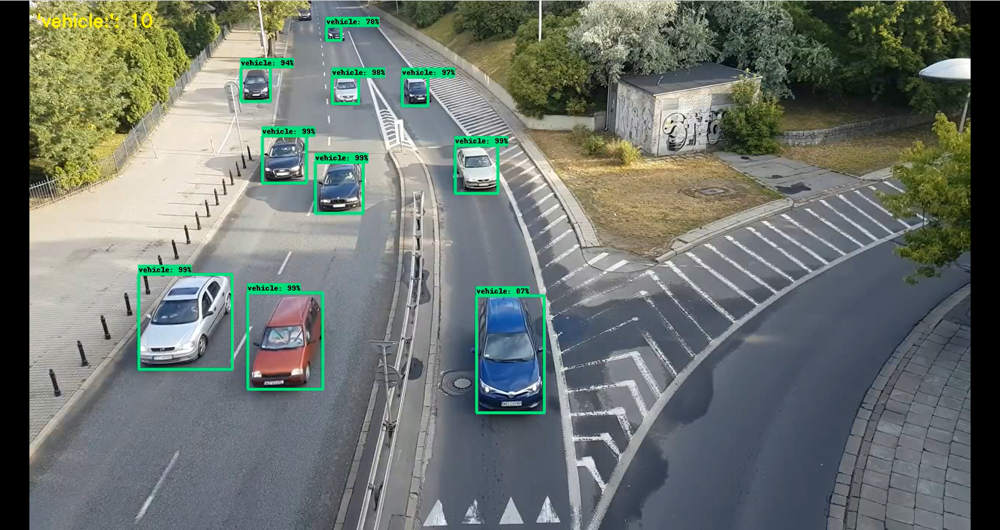
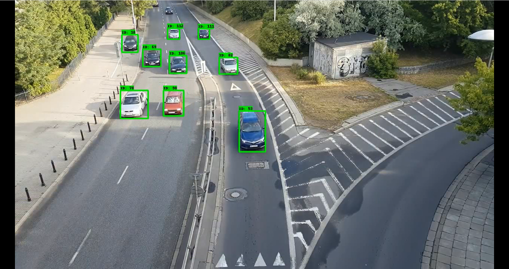
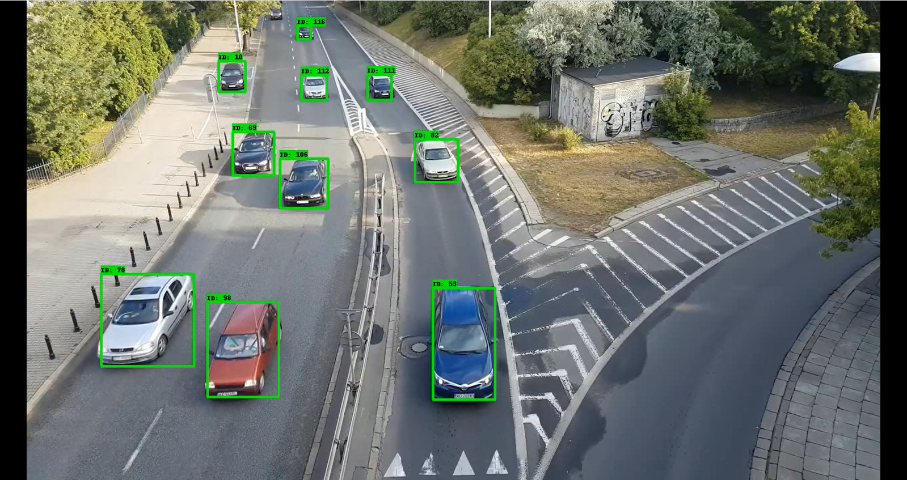
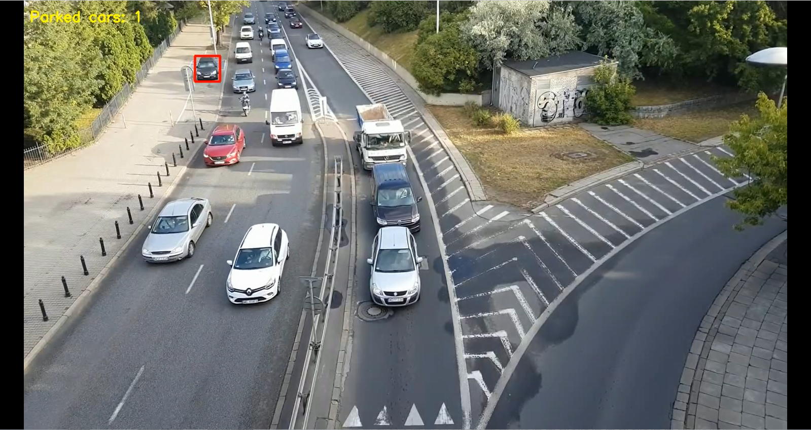

# tensorflow_object_counting_api

## This project implements the task "counting parked cars on video"

The program consists of three modules.

First module is object detection using tensorflow api:

The second module implements the SORT object tracking algorithm:

The third module implements an algorithm for classifying and counting parked cars:

To select the required mode, use the directory "run"
